# M365 Rokid HUD

<p align="center">
  
</p>

<p align="center">
  <a href="https://play.google.com/store/apps/details?id=com.m365bleapp">
    
  </a>
  
  
  
  
  
</p>

<p align="center">
  <a href="https://play.google.com/store/apps/details?id=com.m365bleapp">
    
  </a>
</p>

A modern Android application for connecting to and monitoring Xiaomi/Ninebot M365 electric scooters via Bluetooth Low Energy (BLE), featuring native support for **Rokid AR glasses** as a Heads-Up Display (HUD).

> 📖 **[繁體中文](doc/README_zh-TW.md)** | **[简体中文](doc/README_zh-CN.md)**

[](https://ko-fi.com/liangtinglin)
---

## ✨ Features

- 🔍 **BLE Scanner** - Discover nearby M365 scooters automatically
- 🔐 **Secure Registration** - ECDH key exchange for first-time pairing
- 🔑 **Token-based Login** - Fast reconnection with saved authentication
- 📊 **Real-time Telemetry** - Monitor speed, battery, temperature, and more
- 🕶️ **Rokid AR HUD** - Display telemetry on Rokid glasses via BLE Gateway
- � **Connection Quality Indicator** - Signal strength and data freshness on HUD
- 🔒 **Motor Lock/Unlock** - Control scooter lock status remotely
- 💡 **Tail Light Control** - Toggle tail light on/off
- 🔋 **Battery Optimization Guide** - Prompt to disable battery optimization for stable connection
- 🌍 **Multi-language Support** - 11 languages supported
- 🎨 **Modern UI** - Built with Jetpack Compose and Material3 design

## 📸 Screenshots

|    Scan Screen    |    Dashboard    |    Details     |
| :---------------: | :-------------: | :------------: |
| Discover scooters | Real-time stats | Full telemetry |

## 🌐 Supported Languages

| Language                       | Code           |
| ------------------------------ | -------------- |
| English                        | `en` (default) |
| 简体中文 (Simplified Chinese)  | `zh-CN`        |
| 繁體中文 (Traditional Chinese) | `zh-TW`        |
| Español (Spanish)              | `es`           |
| Français (French)              | `fr`           |
| 日本語 (Japanese)              | `ja`           |
| Русский (Russian)              | `ru`           |
| 한국어 (Korean)                | `ko`           |
| Українська (Ukrainian)         | `uk`           |
| العربية (Arabic)               | `ar`           |
| Italiano (Italian)             | `it`           |

## 🏗️ Architecture

```
M365-Rokid-HUD/
├── app/                          # Main Android Application (Phone)
│   └── src/main/
│       ├── java/com/m365bleapp/
│       │   ├── MainActivity.kt   # App entry point
│       │   ├── ble/              # BLE Manager (scanning, GATT)
│       │   ├── ffi/              # Rust FFI bindings
│       │   ├── gateway/          # GATT Server for glass-hud relay
│       │   ├── repository/       # Data layer (ScooterRepository)
│       │   ├── ui/               # Jetpack Compose screens
│       │   │   ├── NavGraph.kt         # Navigation graph
│       │   │   ├── ScanScreen.kt       # Device discovery
│       │   │   ├── DashboardScreen.kt  # Real-time telemetry
│       │   │   ├── ScooterInfoScreen.kt# Detailed info
│       │   │   ├── LoggingScreen.kt    # Logging settings
│       │   │   ├── LogViewerScreen.kt  # Log file viewer
│       │   │   ├── LanguageScreen.kt   # Language selection
│       │   │   └── theme/              # Material3 theme
│       │   └── utils/            # Utilities (TelemetryLogger, etc.)
│       ├── res/
│       │   ├── values/           # English strings (default)
│       │   ├── values-zh-rCN/    # Simplified Chinese
│       │   ├── values-zh-rTW/    # Traditional Chinese
│       │   └── values-*/         # Other languages (11 total)
│       └── jniLibs/              # Native .so libraries
├── glass-hud/                    # Rokid AR Glass HUD Client
│   └── src/main/
│       └── java/com/m365hud/glass/
│           ├── MainActivity.kt   # Glass app entry point
│           ├── BleClient.kt      # BLE client (connects to phone, with session stats)
│           ├── BleConnectionService.kt # Foreground service for stable connection
│           ├── GattProfile.kt    # GATT service definitions
│           ├── HudScreen.kt      # AR HUD display (with signal indicator)
│           ├── DataModels.kt     # Shared data structures
│           └── ui/               # Compose UI components
├── ninebot-ffi/                  # Rust FFI library for Android
│   └── src/
│       ├── lib.rs                # JNI exports
│       └── mi_crypto.rs          # Cryptographic functions
├── ninebot-ble/                  # Core Rust BLE library
│   └── src/
│       ├── lib.rs                # Library entry point
│       ├── connection.rs         # BLE connection handling
│       ├── protocol.rs           # M365 protocol implementation
│       ├── mi_crypto.rs          # ECDH, HKDF, AES-CCM encryption
│       ├── login.rs              # Login flow implementation
│       ├── register.rs           # Registration flow
│       ├── scanner.rs            # BLE device scanning
│       ├── consts.rs             # Protocol constants
│       └── session/              # Session management
└── doc/                          # Documentation
    ├── BLE_PROTOCOL_GUIDE.md     # Detailed protocol documentation
    └── README_*.md               # Localized READMEs
```

## 🔐 Protocol Overview

The app implements the Xiaomi M365 encrypted BLE protocol:

| Component      | Algorithm        | Description                            |
| -------------- | ---------------- | -------------------------------------- |
| Key Exchange   | ECDH (SECP256R1) | Elliptic curve key exchange            |
| Key Derivation | HKDF-SHA256      | Derive session keys from shared secret |
| Authentication | HMAC-SHA256      | Message authentication                 |
| Encryption     | AES-128-CCM      | Authenticated encryption for UART data |

### Telemetry Data

| Query      | Address | Data                                             |
| ---------- | ------- | ------------------------------------------------ |
| Motor Info | `0xB0`  | Speed, battery %, controller temp, total mileage |
| Trip Info  | `0x3A`  | Current trip time, distance                      |
| Range      | `0x25`  | Estimated remaining range (km)                   |

## 🛠️ Requirements

### Android App

- **Minimum SDK**: Android 10 (API 29)
- **Target SDK**: Android 16 (API 36)
- **Permissions**: Bluetooth, Location (for BLE scanning)

### Build Environment

- Android Studio Ladybug or later
- **Java 21** (JDK 21+)
- Kotlin 2.2.10+ (with Compose compiler plugin)
- Gradle 9.3.0
- Android Gradle Plugin (AGP) 9.0.0
- Rust toolchain (for building native libraries)
- Android NDK

### BLE Scanning Strategy

The app identifies M365 scooters using:

1. **Device Name**: Starts with `MIScooter` (advertised name priority)
2. **Service UUID**: Contains Xiaomi service `0000fe95-0000-1000-8000-00805f9b34fb`

Devices are sorted by: Registered → Scooter → Has Name → Signal Strength (RSSI)

## 🚀 Getting Started

### 1. Clone the Repository

```bash
git clone https://github.com/your-repo/M365-Rokid-HUD.git
cd M365-Rokid-HUD
```

### 2. Build Rust Libraries (if needed)

```bash
cd ninebot-ffi

# Install cargo-ndk if not already installed
cargo install cargo-ndk

# Add Android targets
rustup target add aarch64-linux-android armv7-linux-androideabi

# Build for Android
cargo ndk -t arm64-v8a -t armeabi-v7a -o ../app/src/main/jniLibs build --release
```

### 3. Build Android App

Open the project in Android Studio and build:

```bash
./gradlew assembleDebug
```

Or directly install to connected device:

```bash
./gradlew installDebug
```

## 📖 Usage

1. **Launch the app** and grant Bluetooth/Location permissions
2. **Scan** for nearby M365 scooters
3. **First-time pairing**: Check "Register" and press scooter power button when prompted
4. **Subsequent connections**: Just tap the device to connect
5. **View telemetry** on the Dashboard or Details screen
6. **Enable Rokid HUD Gateway** (optional): Toggle the Gateway switch on Dashboard to broadcast telemetry to Rokid glasses

### Rokid AR Glasses Setup

1. Install the `glass-hud` APK on your Rokid glasses
2. On the phone app, connect to your scooter and enable "Rokid HUD Gateway"
3. On the glasses, the HUD will automatically scan and connect to the phone Gateway
4. The HUD displays: Speed, Scooter Battery, Phone Battery, Glasses Battery, Current Time, and **Signal Quality Indicator**

**HUD Signal Indicators:**

- 📶 = Good signal (RSSI ≥ -80 dBm)
- ⚠️ = Data stale (no update for 2+ seconds)
- 📵 = Not connected

> ⚠️ **Important**: If you see the "Battery optimization enabled" warning on the phone app, tap it to disable battery optimization. This prevents Android from killing the app in background.

> ⚠️ **Warning**: Registration will unpair the scooter from other apps (e.g., Mi Home). Only register devices you own.

## 📁 Project Components

| Module        | Description                                              |
| ------------- | -------------------------------------------------------- |
| `app`         | Main Android app (phone) with Jetpack Compose UI         |
| `glass-hud`   | Rokid AR glass HUD client, displays telemetry from `app` |
| `ninebot-ffi` | Rust library with JNI bindings for Android               |
| `ninebot-ble` | Core Rust library for M365 BLE protocol                  |
| `doc`         | Protocol documentation and localized READMEs             |

## 🤝 Contributing

Contributions are welcome! Please feel free to submit a Pull Request.

## 📄 License

This project is licensed under the MIT License - see the [LICENSE](LICENSE) file for details.

## 🙏 Acknowledgments

- [btleplug](https://github.com/deviceplug/btleplug) - Cross-platform BLE library for Rust
- [Jetpack Compose](https://developer.android.com/jetpack/compose) - Modern Android UI toolkit
- M365 reverse engineering community

---

**Disclaimer**: This project is for educational purposes only. Use at your own risk. The authors are not responsible for any damage to your scooter or violations of manufacturer warranties.
