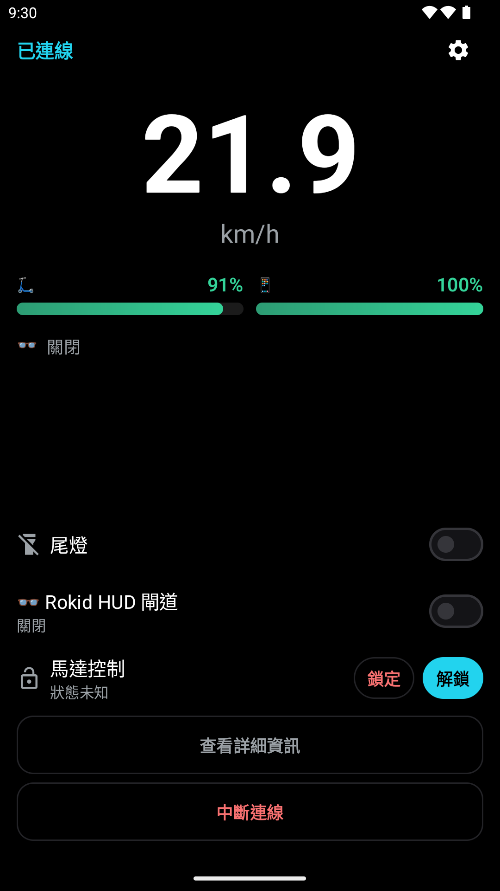
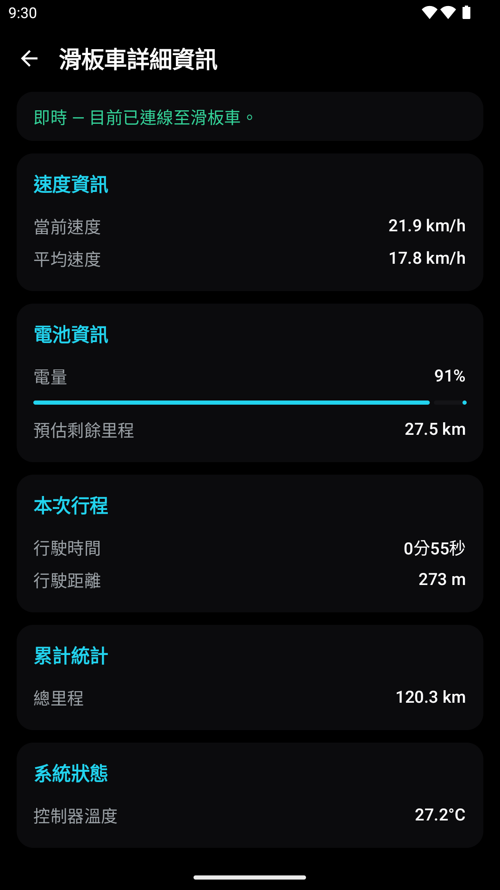
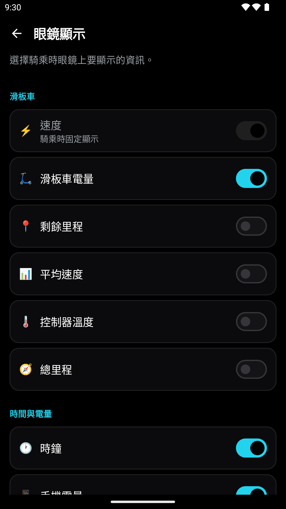
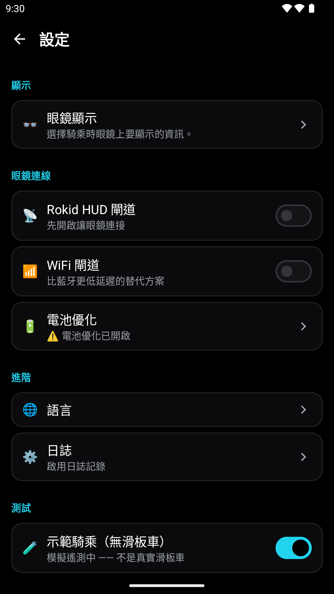
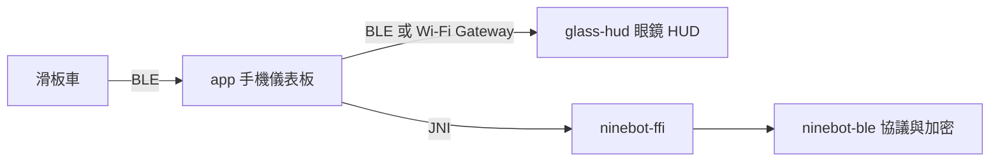

# M365 Rokid HUD

**把滑板車儀表帶進視線。** Android BLE 儀表板，搭配 Rokid AR 眼鏡顯示 HUD；沒有眼鏡也能使用手機儀表板。

<p align="center">
  
</p>

<p align="center">
  <a href="https://play.google.com/store/apps/details?id=com.m365bleapp"></a>
</p>

<p align="center">
  <a href="https://zero2005x.github.io/M365-Rokid-HUD/">官網</a> ·
  <a href="https://github.com/zero2005x/M365-Rokid-HUD/releases">APK Releases</a> ·
  <a href="doc/README_en.md">English</a> · 繁體中文 ·
  <a href="doc/README_zh-CN.md">简体中文</a>
</p>

<p align="center">
  
  
  
  <a href="LICENSE"></a>
</p>

> **先確認相容性：** M365 / Pro / Pro 2 / 1S / Lite 已實作遙測，但目前沒有車型完成實車驗證。Mi 3 協議未確認，Ninebot 車型暫不提供遙測。請先查看[車型支援矩陣](doc/MODEL_SUPPORT.md)。

[功能](#功能亮點) · [截圖](#app-截圖) · [快速開始](#三步快速開始) · [車型](#車型與驗證狀態) · [Rokid 設定](#rokid-hud-設定) · [開發](#開發與架構)

## 功能亮點

| 功能 | 可以做什麼 |
| --- | --- |
| BLE 儀表板 | 查看時速、電量、溫度、里程、估算續航與行程資料；實際欄位依車型支援而定。 |
| Rokid HUD | 手機透過 Gateway 將資料傳給眼鏡端 `glass-hud`；可自訂欄位與字級。 |
| 連線品質 | 查看 RSSI 與資料更新狀態，辨識延遲或斷線。 |
| Demo Ride | 不需滑板車，即可用模擬資料體驗儀表板與 HUD 設定。 |
| 日誌與控制 | 匯出 CSV／除錯日誌；鎖車與尾燈控制依車型和協議支援而定。 |
| 配對金鑰 | 匯入、匯出與手動新增小米／Ninebot 金鑰；與 RideFlux 共用 `.rfbond` 格式。[操作與安全說明](doc/PAIRING_TOKEN_BACKUP.md)。 |
| 多語系 | App 支援 11 種語言；官網提供繁中、英文、簡中。 |

## App 截圖

| 儀表板 | 詳細資訊 | 眼鏡顯示 | 設定 |
| :---: | :---: | :---: | :---: |
|  |  |  |  |

以上為 **Demo Ride 模擬資料**，於模擬器擷取，不代表實車測試結果。[完整多語系截圖](doc/play-store/) · [操作示範 GIF](doc/play-store/promo/demo.gif)

## 三步快速開始

1. **下載與體驗**：從 [Google Play](https://play.google.com/store/apps/details?id=com.m365bleapp) 安裝，或使用 [Releases](https://github.com/zero2005x/M365-Rokid-HUD/releases)。需要 Android 9（API 28）以上；可先用 Demo Ride 體驗。
2. **掃描與配對**：開啟滑板車，授予 App 藍牙／定位等必要權限，點選 Scan。首次配對勾選 Register，並依提示按下滑板車電源鍵；後續使用已儲存的認證連線。
3. **查看儀表**：連線後查看 Dashboard 或 Details。若要使用眼鏡，依下方 Rokid 設定安裝眼鏡端 App 並開啟 Gateway。

> 註冊可能解除與其他 App（例如米家）的配對，請只註冊你擁有的車輛。配對與權限步驟依車型、Android 版本而異。

## 車型與驗證狀態

**辨識到車型、完成連線、讀取遙測、實車驗證是不同階段。** 下表為摘要，詳細限制以 [MODEL_SUPPORT.md](doc/MODEL_SUPPORT.md) 為準。

小米 BLE 辨識規則以 [`identity.rs`](ninebot-ble/src/identity.rs) 中的 `XIAOMI_SCOOTER_MATCH` 為單一來源。

| 車型 | 目前實作狀態 | 驗證與限制 |
| --- | --- | --- |
| Xiaomi M365 / Pro | 遙測欄位已實作 | 文件支持，尚未實車驗證；`0xB0` 回應偏移仍待實車封包確認。 |
| Xiaomi Pro 2 / 1S / Lite | 遙測欄位已實作 | 文件支持，尚無實車封包。 |
| Xiaomi Mi 3 | 可辨識，連線協議未確認 | 不提供遙測。 |
| Ninebot ESx / G30 / E / F / T15 / G2 / F2 / D | 辨識與協議路徑依家族而異 | 無公開暫存器配置，暫不提供遙測；尚未實車驗證。 |
| Segway GT / P / ZT3 / Max G3 | 不在目前支援範圍 | 支援狀態未知。 |

手動選擇車型只決定嘗試哪個配置，**不會提高驗證等級**。沒有配置的欄位會隱藏，不顯示猜測數值。

## Rokid HUD 設定

1. 在相容的 Rokid 裝置安裝 Releases 中的 `glass-hud` APK。手機 App 與眼鏡 App 是兩個獨立元件。
2. 手機先連線滑板車，或使用 Demo Ride，再於 Dashboard 開啟 **Rokid HUD Gateway**。
3. 啟動眼鏡端 HUD，透過 BLE Gateway 連線手機。另有 Wi-Fi 傳輸路徑；請依實際裝置及版本選用。
4. 在手機的眼鏡顯示設定中選擇欄位與字級。HUD 可顯示時速、滑板車／手機／眼鏡電量、時間與連線品質。

- RSSI ≥ -80 dBm：良好訊號；超過 2 秒未更新：資料延遲；未連線：斷線狀態。
- 若出現電池最佳化提示，可依引導允許背景運作，降低連線被系統中止的機會。
- CXR-M 是手機端 SDK；本專案 release 刻意不包含其憑證，不應把開發用 CXR 路徑當成正式版必要條件。
- [眼鏡日誌收集](doc/GLASSES_LOG_COLLECTION.md) · [完整繁中技術與使用文件](doc/DEVELOPER_zh-TW.md)

## 開發與架構


```mermaid
flowchart LR
    Scooter[滑板車] -->|BLE| Phone[app 手機儀表板]
    Phone -->|BLE 或 Wi-Fi Gateway| Glasses[glass-hud 眼鏡 HUD]
    Phone -->|JNI| FFI[ninebot-ffi]
    FFI --> Core[ninebot-ble 協議與加密]
```

| 模組 | 職責 |
| --- | --- |
| `app/` | Kotlin／Compose 手機 UI、BLE、Gateway；CXR-M 僅供配置憑證的開發路徑。 |
| `glass-hud/` | 眼鏡 HUD、BLE／Wi-Fi 客戶端與連線路由。 |
| `ninebot-ffi/` | Rust JNI 橋接。 |
| `ninebot-ble/` | 協議、加密、識別與車型配置。 |
| `doc/` | 技術文件與 App 截圖。 |
| `docs/` | GitHub Pages 官網與獨立靜態資產。 |

<details>
<summary>協議與深入技術文件</summary>

Xiaomi Mi auth 使用 ECDH（SECP256R1）、HKDF-SHA256、HMAC-SHA256 與 AES-128-CCM。Ninebot legacy 加密已實作但未驗證；Encryption2 握手已實作，兩者暫不提供遙測。

- [BLE 協議指南](doc/BLE_PROTOCOL_GUIDE.md)
- [協議家族對照](doc/PROTOCOL_FAMILIES.md)
- [Ninebot Legacy](doc/NINEBOT_LEGACY_PROTOCOL.md)
- [車型矩陣與偏移待確認事項](doc/MODEL_SUPPORT.md)
- [完整繁中開發文件](doc/DEVELOPER_zh-TW.md) · [English technical documentation](doc/README_en.md)

完整文件保留原有模組樹、暫存器、掃描識別與編譯說明。

</details>

### 編譯

需要 JDK 21、Android SDK／NDK、Rust 與 cargo-ndk。Gradle wrapper 為 9.6.1，AGP 9.0.0，Compose plugin 2.2.10；版本以建置設定為準。

```bash
git clone https://github.com/zero2005x/M365-Rokid-HUD.git
cd M365-Rokid-HUD
cargo install cargo-ndk
rustup target add aarch64-linux-android armv7-linux-androideabi i686-linux-android x86_64-linux-android
./gradlew assembleDebug
```

Windows PowerShell 使用 `./gradlew.bat assembleDebug`。Gradle 會建置 Rust JNI。
只做 UI／Demo Ride 開發時可加 `-PskipRustBuild`，但缺少 native library 時 BLE 加密無法正常運作；release 不允許跳過必要驗證。

[Windows／WSL 建置說明](doc/WINDOWS_WSL_BUILD.md) · [官網預覽與部署](docs/README.md)

## 貢獻與支持

歡迎提交 Issues、Pull Requests 與實車封包，協助驗證車型配置。[Ko-fi 支持開發](https://ko-fi.com/liangtinglin)

App 語言：English、繁體中文、简体中文、Español、Français、日本語、Русский、한국어、Українська、العربية、Italiano。

感謝 [btleplug](https://github.com/deviceplug/btleplug)、[Jetpack Compose](https://developer.android.com/jetpack/compose) 與 M365 逆向社群。

[MIT License](LICENSE)。本專案供教育用途，使用風險由使用者承擔；作者不對滑板車損壞或保固問題負責。騎乘前完成設定，勿依賴未驗證的數據做安全判斷。
